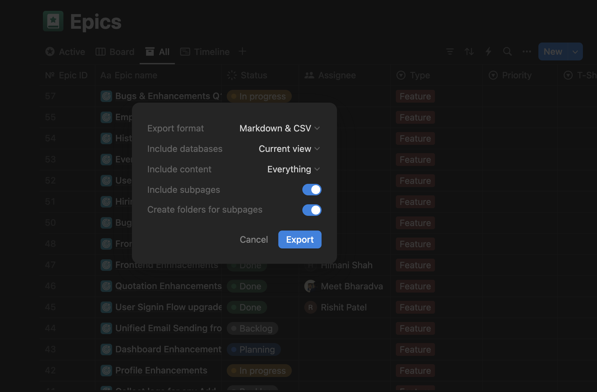
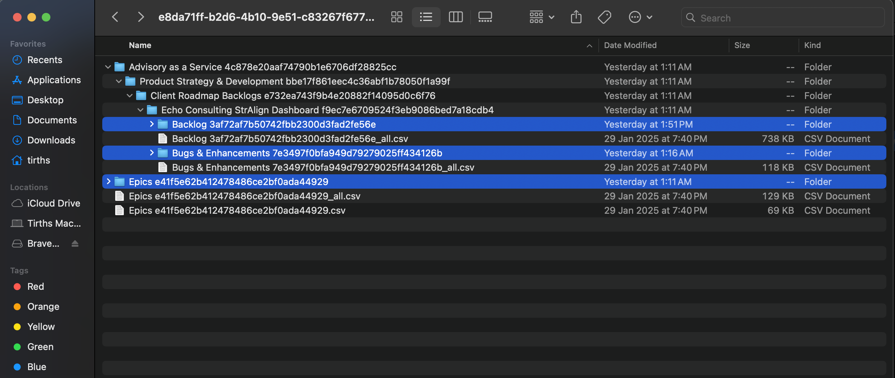
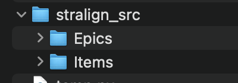
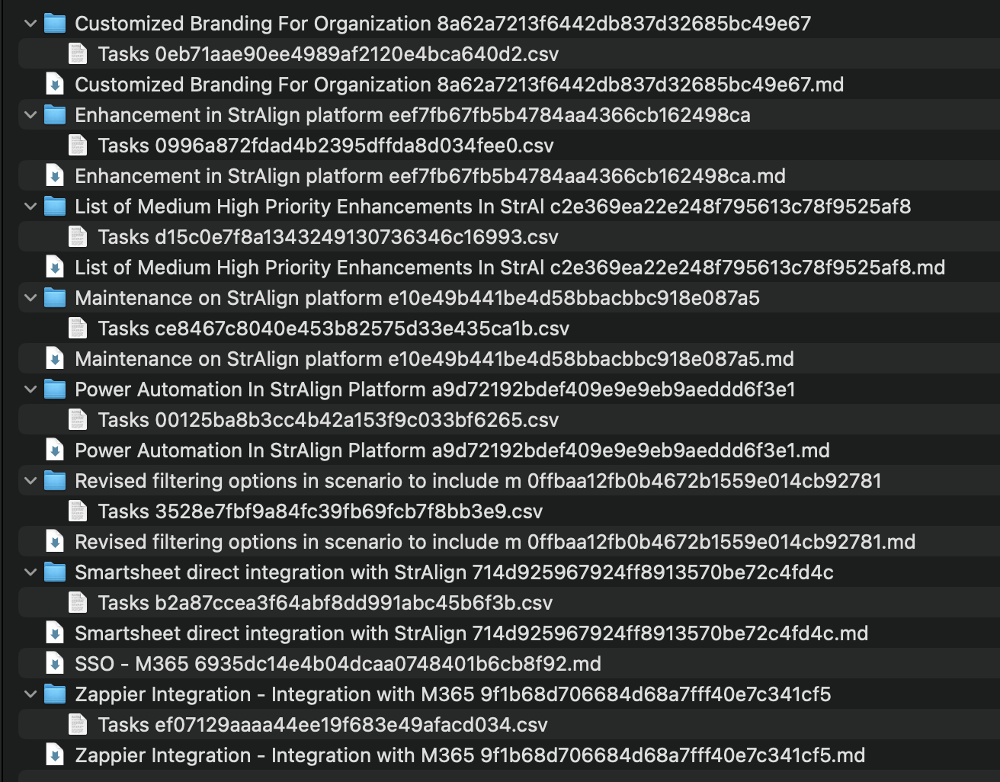
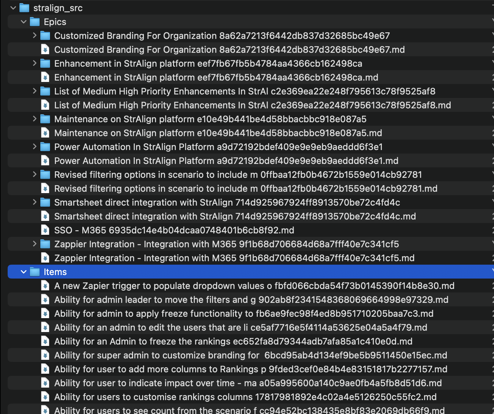

# Notion to Jira Migration via Python Script

# Overview:

- The aim of this script is to migrate existing Epics data from Notion page (database) to Jira Project.
- It claims to persist the hierarchy of the Epic Task and Child Tasks in Jira as well.

---

# Pre-Requisites

The script runs in optimal state when it requirements are set-up correctly.

## Notion Data Export

Export the data of your Epic database using following steps:

1. Select **All** view and Click on … and select Export (of your Epic).
    
    
    
2. Choose the configuration as shown in image above. Make sure to **Include subpages** in your Export.
3. Wait for the Export to finish. You will be mailed when completed.
4. Extract the Zip file and observe the directory structure.
    
    
    
5. Notice the highlighted folders. These folders are required by the script to execute. You need to structure the files in these folders in following way:
    1. Create a root folder say **`<project_name>_src` .** 
    2. Within it create another folder named **`Epics` .** Copy the contents of **`Epics e41…`** folder into **`Epics`** folder.
    3. Within <project_name>_src create another folder (along with Epics folder) named **`Items`**. Copy the **Markdown** files (**`.md`** extension files) under your Project name folder and its subfolders into Items folder.
    For example, the markdown files under **`Echo Consulting <…>`** folder will be located inside **`Backlog <..>`** and **`Bugs & Enhancements <…>`** directories. Copy them and place it in Items folder.
    *Note: The Items folder should not have any folders, only markdown files.*
    4. The final folder must have following structure:
        
        
        
    
    
    
    Epics folder structure, must contain folders with Tasks .csv and Markdown files.
    
    
    
    Items folder structure, only contain Markdown files.
    
    > Note: 
    The Epics directory represents all the Epics in your notion, where every folder within it represents Tasks (or Stories) data associated with Epic. `.md` files represent Epic pages in your Notion.
    The Items directory represents all the Task and Subtask pages in your Notion.
    > 
6. Compress the root folder into a zip file.

## Jira Project setup and tokens

Login to Jira and perform following actions:

- Create project and note the **Project Key** (in Capital Alphabets, usually up to 5 characters)
- Add the users with email ids and Full Name into your project.
- Make sure to enable following issue types in your project if not:
    - Epic
    - Task
    - Subtask
- Login to [id.atlassian.com](http://id.atlassian.com) and head towards **Security** section. Generate an **`API token`** and store it in notes.

Following details are required to push data into Jira:

- Server Url ()
- Username (Email address of the PM or APM having full access to the Jira Project)
- API Token
- Project Key

## Python and Script Pre-Execution

- Copy the folder of exports data in the path relative to the script. (generally with src folder).
- Install the requirements specified in requirements.txt file.
- Note the column header text in **`Tasks <…> .csv`** files in Epic subfolders. You might need to modify that in `read_csv` function in the `data_script.py` file.
- Create a `.env` file along with `data_script.py` and store the above Jira credentials with following keys:

```bash
JIRA_SERVER_URL="https://example-org.atlassian.net/"
JIRA_USERNAME="tirths@york.ie"
JIRA_TOKEN="<your_atlassian_api_token"
JIRA_PROJECT_KEY="DEMO"
```

- Enter the path of your root directory (containing Epics and Items folders) in CLI parameter.

---

# Execution

Run the script with following command:

```bash
python3 -m ./data_script.py --root=<path_of_root_dir>
```

Note the logs in terminal and logs folder latest file to debug if any error occurs.

---

# Limitations

- Unable to create Story due to default hierarchical settings in Jira. Need to change it to accept Subtasks or Tasks within Story in Jira.
- Currently supported fields mapped in Jira are:
    - Title
    - Description
    - Assignee
    - Reporter
    - Priority

---

# Improvements

- Extend support for following fields:
    - Status of Issues using transition api
    - Inclusion of story points of tasks and sub-tasks